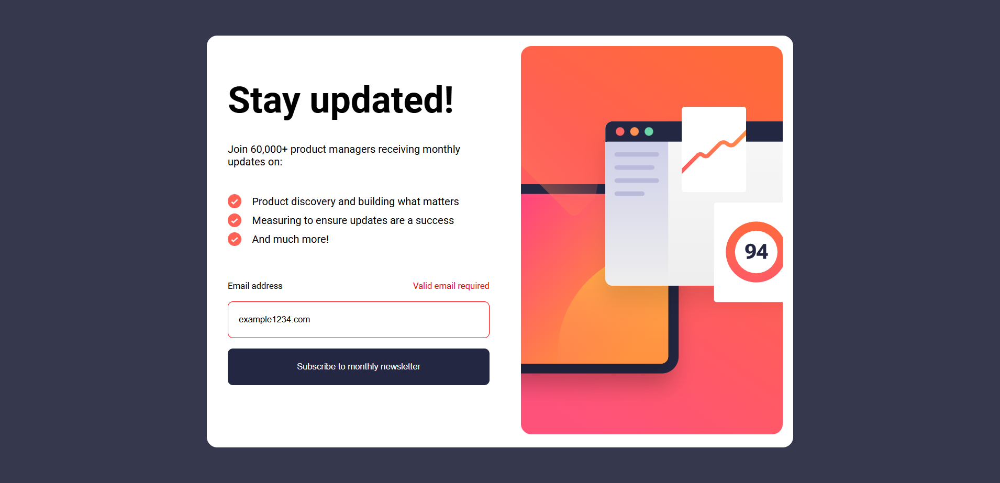
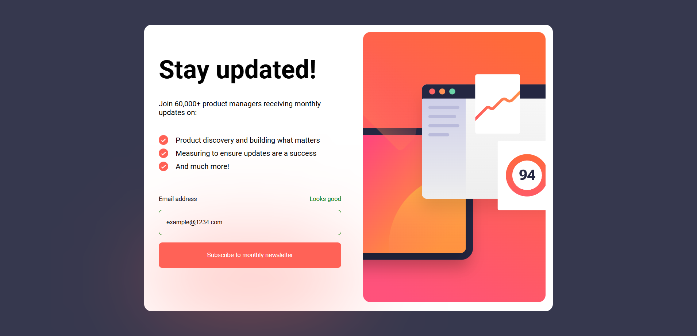

# Frontend Mentor - Newsletter sign-up form with success message solution

This is a solution to the [Newsletter sign-up form with success message challenge on Frontend Mentor](https://www.frontendmentor.io/challenges/newsletter-signup-form-with-success-message-3FC1AZbNrv). Frontend Mentor challenges help you improve your coding skills by building realistic projects.

## Table of contents

- [The challenge](#the-challenge)
- [Screenshot](#screenshot)
- [Links](#links)
- [My process](#my-process)
  - [Built with](#built-with)
  - [What I learned](#what-i-learned)
  - [Continued development](#continued-development)
  - [Useful resources](#useful-resources)
- [Author](#author)

### The challenge

Users should be able to:

- Add their email and submit the form
- See a success message with their email after successfully submitting the form
- See form validation messages if:
  - The field is left empty
  - The email address is not formatted correctly
- View the optimal layout for the interface depending on their device's screen size
- See hover and focus states for all interactive elements on the page

### Screenshot





### Links

- Solution URL: (https://github.com/Lovely1608/newsletter-sign-up-form.git)
- Live Site URL: (https://lovely1608.github.io/newsletter-sign-up-form/) 

## My process

1. Planning

I started by analyzing the design and setting up my project structure. Then, I linked my CSS and JavaScript files to the HTML file to begin building.

2. Building the Layout

I focused first on writing clean, semantic HTML. During this step, I learned about the <picture> tag for handling responsive images — it was fascinating to see how it works similarly to media queries, but directly within HTML.
I also applied the mobile-first approach, based on feedback from my previous project, and I’m glad I got to implement this technique here.

3. Styling and Responsiveness

I used CSS Flexbox for the main layout and tested the design across different screen sizes using Chrome DevTools.
I adjusted fonts, images, and spacing to prevent layout shifts and improve overall performance, making sure everything looked consistent on all devices.

4. JavaScript / Logic

I implemented form validation using regular expressions and kept the logic simple and readable with small conditional statements.
Two main challenges I faced were:

Understanding the difference between local and domain parts of an email — which helped me learn about the split() function.

Figuring out how to reset the form after submission — I solved it using window.location.reload().

5. Learning Outcomes

Through this project, I gained a deeper understanding of:

Writing semantic and accessible HTML

Building logic before focusing on design

Preventing layout shifts (CLS) for better performance

Structuring projects more efficiently

### Built with

- Semantic HTML5 markup
- CSS custom properties
- Flexbox
- Mobile-first workflow
- java script

### What I learned

In this project, I learned about the <picture> tag, which helps to show different images for different devices automatically. It works somewhat like a media query but handles the image changes on its own.

I also learned about the classList property, which I used to add or remove classes in JavaScript.

To see how you can add code snippets, see below:

```html
<picture>
  <!--using media for mediaquery -->
  <source
    media="(min-width: 64rem)"
    srcset="images/illustration-sign-up-desktop.svg" />
  <source
    media="(min-width: 30rem)"
    srcset="images/illustration-sign-up-tablet.svg" />
  </picture>

<small
  >this is a new tag which I used with input tag for show information
</small>
```

```css
learn this css property :focus {
  outline: none;
}
```

```js
const regex = /^[a-zA-Z0-9._%+-]+@[a-zA-Z0-9.-]+\.[a-zA-Z]{2,}$/;

const [local, domain] = email.value.split("@");

submitBtn.classList.add("successBtn");
```

### Continued development

I am still not good with regular expression uses with js and my if condition can get more good and robust for making my function more readable

### Useful resources

- [FreeCodeCamp resource 1](https://www.freecodecamp.org/news/build-and-validate-beautiful-forms-with-vanilla-html-css-js/) - This helped me for email validation and how to use the advice for making my form look more . I really liked this learning and will use it going forward.
- [MDN Document resource 2](https://developer.mozilla.org/en-US/docs/Learn_web_development/Extensions/Forms/Form_validation) - This is an amazing article which helped me finally understand how to validate simple form. I'd recommend it to anyone still learning this concept it will help you to brush upon your skills .

## Author

- Frontend Mentor - [Lovely](https://www.frontendmentor.io/solutions/article-preview-component-GJhV0x-P84)
